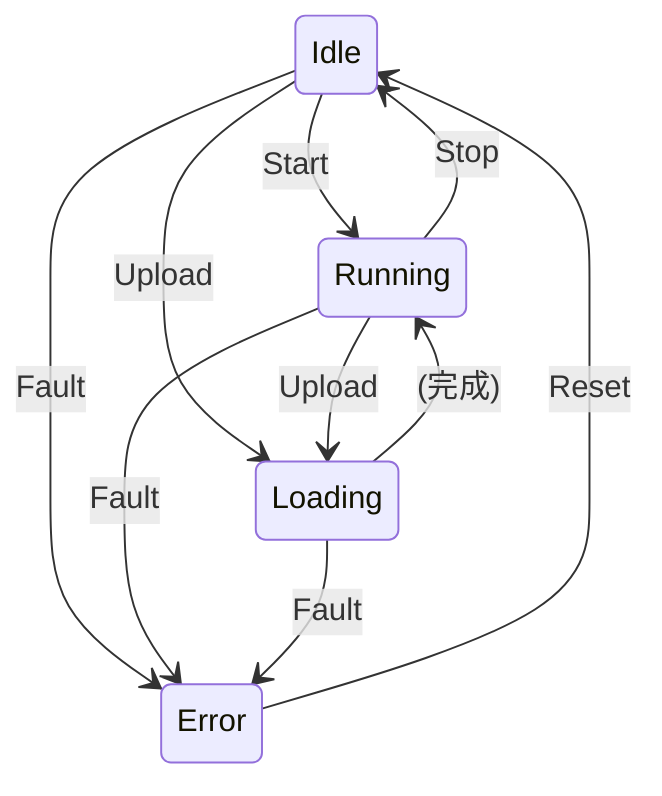
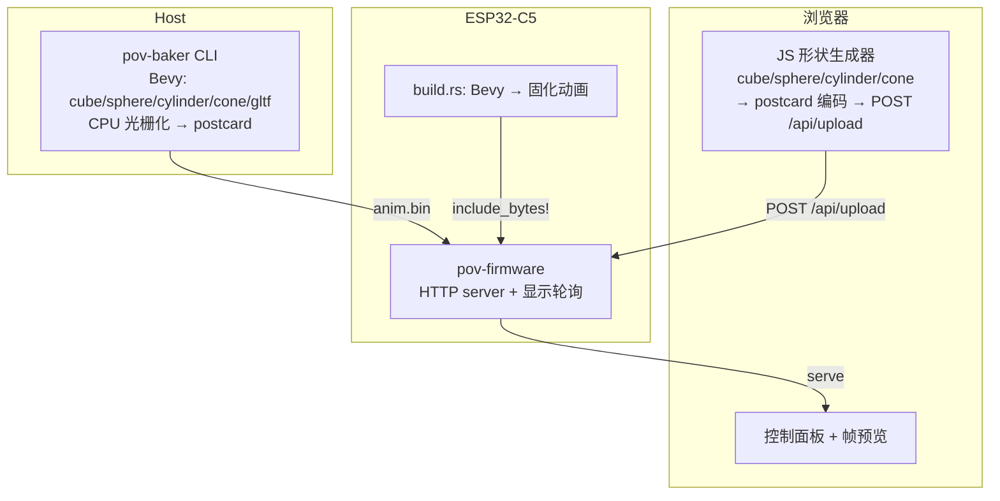
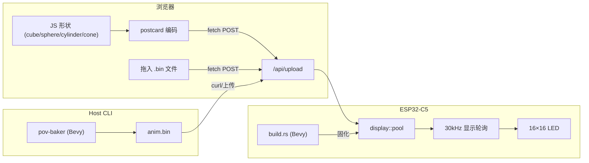

# POV Display System Architecture — v9

## Physical Setup

```
16×16 LED matrix · 4mm pitch · 60×60mm active area
PCB stands vertically (Y axis), rotates around Z axis (motor shaft)
Volumetric POV: each angle = 2D cross-section through 3D model
```

## Hardware

| 芯片 | ESP32-C5 (RISC-V) |
|------|-------------------|
| PSRAM | 8 MB (堆内存) |
| 编码器 | AS5047P (SPI + DMA, 14-bit) |
| 显示 | 4×74HC595 (PARL_IO TX + DMA) |
| 电机控制 | 速度闭环 PID |

### Pin Map

| 信号 | IO | 外设 |
|------|----|------|
| MISO | 2 | AS5047P SDO → SPI2 |
| SCK | 6 | AS5047P CLK → SPI2 |
| MOSI | 7 | AS5047P SDI → SPI2 |
| CS | 10 | AS5047P SSN → GPIO |
| PARL_DATA0 | 25 | HC595#0 SER (列选低) |
| PARL_DATA1 | 9 | HC595#1 SER (列选高) |
| PARL_DATA2 | 23 | HC595#2 SER (行数据低) |
| PARL_DATA3 | 24 | HC595#3 SER (行数据高) |
| PARL_CLK | 5 | 所有 HC595 SRCLK |
| RCLK | 4 | 所有 HC595 RCLK |
| 电机 PWM | 3 | LEDC → 电机驱动 |

## 5. 开发工具链 (Development Tools)

为了提高开发效率并解决降采样预览问题，项目提供了一个原生 GUI 工具。

### 5.1 Native GUI Tool (Bevy + egui)
- **3D 预览**: 使用 Bevy GPU 渲染 3D 模型，支持实时旋转和参数调节。
- **LED 仿真**: 使用与固件一致的 CPU 光栅化算法，实时生成 16×16 预览网格，确保“所见即所得”。
- **一键上传**: 直接通过 HTTP POST 将烘焙好的二进制动画发送给 ESP32。
- **环境隔离**:
    - **Host**: 使用 `run-gui.sh` 调用 nightly 工具链编译，避免与嵌入式 `build-std` 冲突。
    - **Embedded**: 使用 `run-firmware.sh` 编译 ESP32 固件。

### 5.2 编译与运行
- **运行 GUI 工具**: `./run-gui.sh`
- **编译/烧录固件**: `./run-firmware.sh`

---
*Updated to v10 - 2026-05-03: Integrated Native GUI Tool and isolated build environments.*

## State Machine



## Memory Map

```
Internal DRAM (~400 KB)
├── KEYFRAME_STORE [Keyframe; 1024]  ← 34 KB
├── PAGE_RANGES, counters
├── Embassy 任务栈
└── TCP / WiFi buffers

PSRAM Heap (8 MB)
├── alloc::Vec / String
├── JSON 响应
└── 多页动画数据
```

## Data Model

```rust
Animation { pages: Vec<Page> }
Page { keyframes: Vec<Keyframe> }
Keyframe { angle_tick: u16, frame: [u16; 16] }
```

## Architecture



## Data Flow



## Firmware Module Map

```
src/
├── main.rs             — WiFi, HTTP, 显示轮询
├── lib.rs
├── fsm/mod.rs          — statig 状态机
├── display/
│   ├── pool.rs         — keyframe 存储 + 二分查找
│   ├── driver.rs       — FrameWriter trait
│   ├── parl_io.rs      — PARL_IO + DMA
│   └── embedded.rs     — 固化动画加载
├── sensor/encoder.rs   — AS5047P SPI
├── control/            — PID 速度环
└── web/                — HTTP API
```

## Key Design Decisions

1. **无中断** — 全轮询，Ticker 33µs 驱动
2. **稀疏 keyframe** — 只存变化帧，二分查找 O(log K)
3. **列扫描 PARL_IO DMA** — 16 µs/帧，33µs 窗口充裕
4. **PSRAM 堆** — 8MB，热路径在 DRAM
5. **双烘焙通道** — CLI (Bevy) + 浏览器 (JS 解析几何)
6. **build.rs 固化** — Bevy 生成编译时嵌入动画，上电即显
7. **前端纯 JS** — 形状生成 + postcard 编解码，无 WASM 依赖
8. **FSM 统一控制** — display_task 检查 FSM 状态（Loading 时暂停），无独立暂停标志
9. **单一计数器** — 动画计数器仅在 pool 模块维护，避免状态漂移
